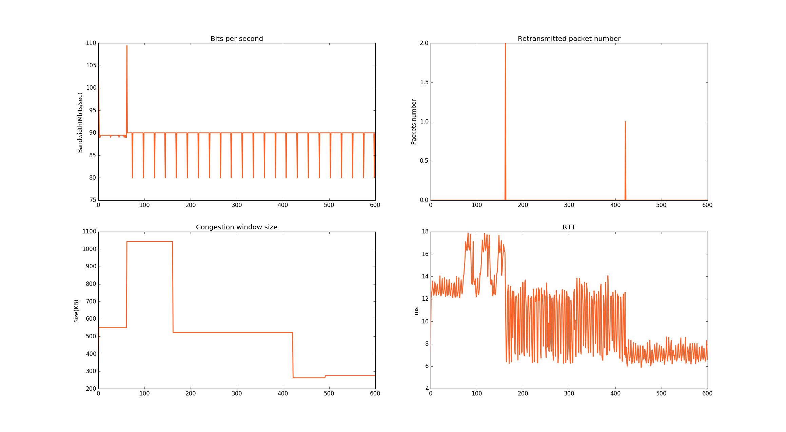
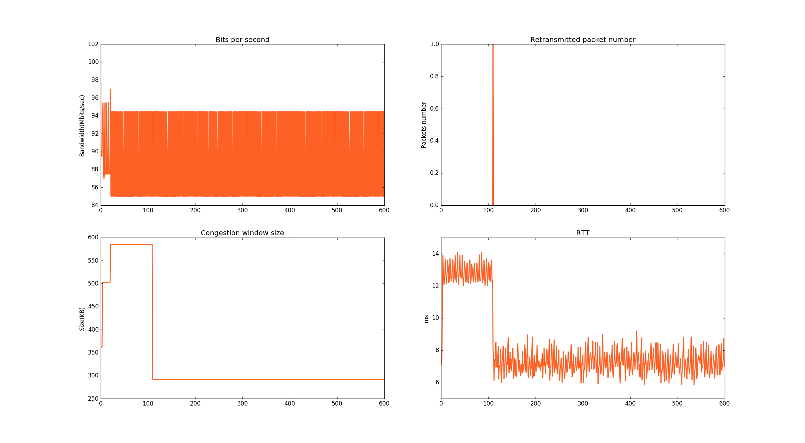
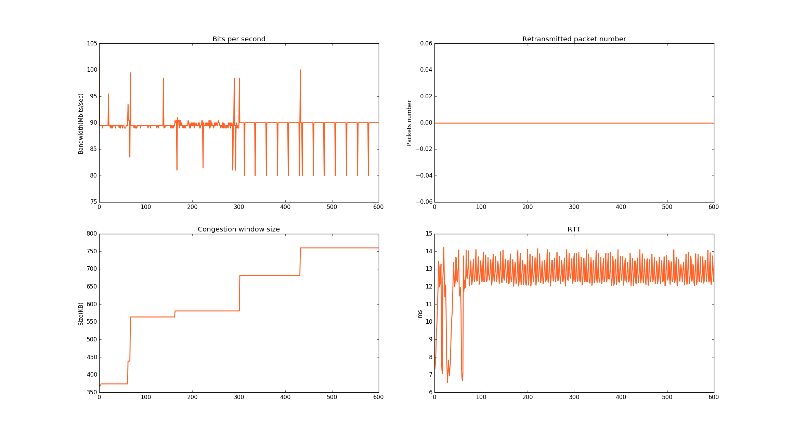
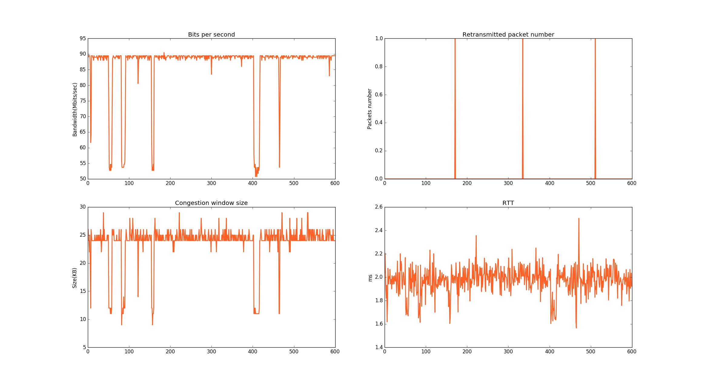
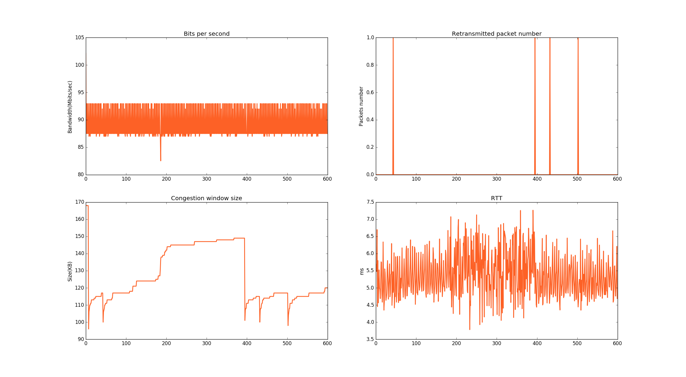
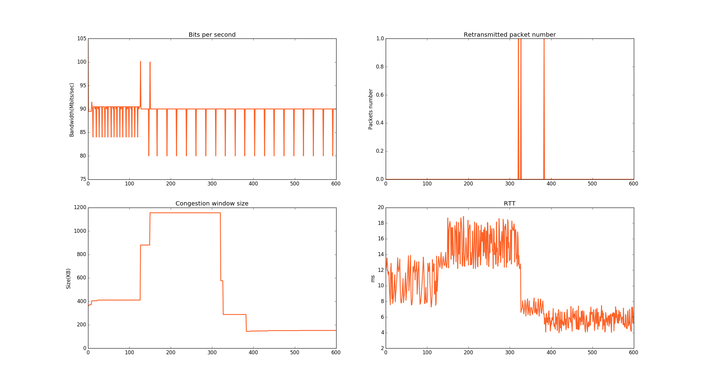

# Lab Record

**开始实验之前需要把收发双方的 iperf3 升级为 [GitHub](https://github.com/esnet/iperf.git) 上的最新版本。**

## 1. dc1 to lan

### 1.1 benchmark

Duration: 24 hours.

Start time: 2017-08-14 21:00

**Status: Finished**

基准测试结果（共 86400s，取 10000s - 70000s）

||Max|Min|Median|Average|Var|
|-|--|---|------|-------|---|
|RTT(ms)|57.00|3.00|8.40|7.00|7.44|
|Bandwidth(Mbit/s)|100.01|70.00|89.55|90.00|4.28|
|Retransmission Packet|15.00|0.00|0.01|0.00|0.02|
|BDP(Mbit)|2800.27|70|376.32|376.32|

结果图像（原始结果：0s - 86400s）：

> 结论：已完成，意外结果较多。故生成上表统计数据的时候采用 10000.0s - 70000.0s 之间网络较为稳定时的数据。

### 1.2 test 0

Duration: 12 hours.

Start time: 2017-08-15 22:00

**Status: Finished**

Duration: 6h

测试结果：

#### round_0
||Algorithm|Max|Min|Median|Average|Var|
|-|--|---|------|-------|---|--|
|RTT(ms)|bbr|5.44|1.51|3.71|3.72|0.18|
||scalable|21.48|5.21|10.47|11.47|7.12|
||bic|14.55|5.02|9.02|8.08|6.46|
||cubic|14.20|4.21|7.77|7.14|4.18|
||highspeed|19.45|5.22|12.20|12.41|13.92|
||htcp|17.89|5.89|10.30|10.56|10.49|
||hybla|14.07|5.85|8.23|7.35|4.98|
||illinois|14.23|6.56|12.58|12.63|1.40|
||vegas|2.50|1.57|1.97|1.99|0.01|
||yeah|7.26|3.78|5.38|5.30|0.42|
||reno|18.87|3.97|9.95|8.43|18.83|
|Bandwidth(Mbit/s)|bbr|103.67|74.00|88.33|89.48|13.41|
||scalable|105.63|70.00|89.58|90.00|6.96|
||bic|102.15|89.00|89.53|89.48|1.02|
||cubic|95.45|83.51|89.50|89.48|6.17|
||highspeed|110.00|79.99|89.65|90.00|9.36|
||htcp|109.45|79.99|89.63|90.00|4.78|
||hybla|101.96|85.00|89.61|87.25|22.19|
||illinois|102.65|79.99|89.59|90.00|3.78|
||vegas|90.48|50.71|86.63|89.00|77.13|
||yeah|102.12|82.52|89.48|87.50|7.42|
||reno|104.60|79.99|89.63|90.00|4.89|
|Retransmission Packet|bbr|2.00|0.00|0.01|0.00|0.02|
||scalable|4.00|0.00|0.01|0.00|0.04|
||bic|2.00|0.00|0.01|0.00|0.01|
||cubic|1.00|0.00|0.01|0.00|0.01|
||highspeed|2.00|0.00|0.01|0.00|0.01|
||htcp|2.00|0.00|0.01|0.00|0.01|
||hybla|1.00|0.00|0.00|0.00|0.00|
||illinois|0.00|0.00|0.00|0.00|0.00|
||vegas|1.00|0.00|0.01|0.00|0.00|
||yeah|1.00|0.00|0.01|0.00|0.01|
||reno|1.00|0.00|0.01|0.00|0.00|
|BDP(Kbit)|bbr|156.75|
||scalable|550.53|
||bic|513.09|
||cubic|401.76|
||highspeed|574.66|
||htcp|644.88|
||hybla|596.07|
||illinois|673.25|
||vegas|141.70|
||yeah|386.10|
||reno|415.26|

bbr:

scalable:

bic:

cubic:

highspeed:

htcp:

hybla:

illinois:

vegas:

yeah:

reno:

#### round_1

||Algorithm|Max|Min|Median|Average|Var|
|-|--|---|------|-------|---|--|
|RTT(ms)|bbr|4.38|1.51|3.66|3.69|0.14|
||scalable|14.60|5.26|10.08|10.86|7.62|
||bic|14.49|4.64|6.99|6.93|0.74|
||cubic|14.28|4.12|6.79|6.76|1.03|
||highspeed|7.39|3.98|5.38|5.25|0.40|
||htcp|10.17|4.30|6.53|6.60|0.65|
||hybla|7.01|3.69|5.18|5.11|0.27|
||illinois|7.60|3.67|5.68|5.66|0.63|
||vegas|2.36|1.49|1.90|1.92|0.02|
||yeah|7.44|3.88|5.49|5.38|0.55|
||reno|7.71|3.95|5.51|5.42|0.64|
|Bandwidth(Mbit/s)|bbr|104.12|74.57|88.38|89.98|15.89|
||scalable|113.20|79.99|89.62|90.00|4.92|
||bic|95.13|85.51|89.59|89.48|2.64|
||cubic|94.46|85.01|89.60|89.48|0.57|
||highspeed|93.86|87.00|89.58|89.48|0.33|
||htcp|92.54|86.99|89.60|90.48|2.61|
||hybla|91.48|87.49|89.58|89.48|0.20|
||illinois|92.47|84.51|89.58|89.48|0.33|
||vegas|89.98|51.70|76.74|88.49|239.06|
||yeah|92.39|85.51|89.58|89.48|0.25|
||reno|93.90|86.00|89.57|89.48|0.27|
|Retransmission Packet	|bbr|1.00|0.00|0.00|0.00|0.00|
||scalable|1.00|0.00|0.01|0.00|0.00|
||bic|1.00|0.00|0.00|0.00|0.00|
||cubic|1.00|0.00|0.01|0.00|0.01|
||highspeed|1.00|0.00|0.01|0.00|0.01|
||htcp|0.00|0.00|0.00|0.00|0.00|
||hybla|3.00|0.00|0.02|0.00|0.03|
||illinois|1.00|0.00|0.01|0.00|0.01|
||vegas|1.00|0.00|0.00|0.00|0.00|
||yeah|1.00|0.00|0.00|0.00|0.00|
||reno|1.00|0.00|0.01|0.00|0.00|
|BDP(Kbit)|bbr|157.32|
||scalable|594.98|
||bic|441.61|
||cubic|388.97|
||highspeed|373.20|
||htcp|398.29|
||hybla|337.73|
||illinois|338.98|
||vegas|134.07|
||yeah|358.31|
||reno|370.61|

#### round_2

||Algorithm|Max|Min|Median|Average|Var|
|-|--|---|------|-------|---|--|
|RTT(ms)|bbr|4.39|1.49|3.65|3.66|0.13|
||scalable|7.54|3.92|5.51|5.45|0.54|
||bic|34.86|3.90|6.54|6.52|2.40|
||cubic|14.47|4.41|11.19|12.36|8.10|
||highspeed|7.97|3.95|5.47|5.38|0.53|
||htcp|9.93|4.06|6.31|6.48|0.78|
||hybla|7.73|4.02|5.35|5.25|0.35|
||illinois|7.55|4.02|5.63|5.56|0.62|
||vegas|2.73|1.53|1.78|1.76|0.01|
||yeah|7.13|4.06|5.26|5.18|0.26|
||reno|7.53|3.98|5.63|5.61|0.61|
|Bandwidth(Mbit/s)|bbr|99.66|74.56|88.37|89.48|13.96|
||scalable|92.36|86.00|89.58|89.48|0.26|
||bic|95.45|78.54|89.43|89.48|2.56|
||cubic|117.41|79.99|89.65|90.00|5.01|
||highspeed|93.13|83.02|89.58|89.48|0.35|
||htcp|94.03|86.00|89.59|89.98|1.92|
||hybla|91.97|87.99|89.59|89.48|0.23|
||illinois|92.53|87.49|89.59|89.48|0.42|
||vegas|90.04|49.21|60.17|55.18|147.92|
||yeah|92.87|87.99|89.58|89.48|0.22|
||reno|92.41|87.00|89.59|89.48|0.57|
|Retransmission Packet	|bbr|1.00|0.00|0.00|0.00|0.00|
||scalable|0.00|0.00|0.00|0.00|0.00|
||bic|16.00|0.00|0.14|0.00|1.23|
||cubic|26.00|0.00|0.04|0.00|1.13|
||highspeed|1.00|0.00|0.00|0.00|0.00|
||htcp|1.00|0.00|0.00|0.00|0.00|
||hybla|1.00|0.00|0.00|0.00|0.00|
||illinois|0.00|0.00|0.00|0.00|0.00|
||vegas|1.00|0.00|0.01|0.00|0.00|
||yeah|1.00|0.00|0.01|0.00|0.01|
||reno|0.00|0.00|0.00|0.00|0.00|
|BDP(Kbit)|bbr|148.40|
||scalable|362.15|
||bic|372.17|
||cubic|517.78|
||highspeed|368.07|
||htcp|382.14|
||hybla|369.63|
||illinois|371.78|
||vegas|138.03|
||yeah|376.68|
||reno|367.87|

#### round_3

||Algorithm|Max|Min|Median|Average|Var|
|-|--|---|------|-------|---|--|
|RTT(ms)|bbr|4.26|1.48|3.65|3.69|0.15|
||scalable|7.48|3.92|5.53|5.45|0.59|
||bic|10.45|4.12|6.41|6.53|0.87|
||cubic|14.11|4.40|7.08|7.04|0.84|
||highspeed|7.62|3.95|5.69|5.64|0.63|
||htcp|8.63|3.90|6.31|6.40|0.81|
||hybla|7.35|3.95|5.25|5.15|0.27|
||illinois|7.66|4.01|5.74|5.74|0.68|
||vegas|2.10|1.52|1.76|1.75|0.01|
||yeah|7.84|4.00|5.48|5.39|0.50|
||reno|8.22|3.99|5.54|5.47|0.57|
|Bandwidth(Mbit/s)|bbr|100.31|74.57|88.38|89.48|14.35|
||scalable|92.86|88.99|89.59|89.48|0.23|
||bic|93.48|87.00|89.59|89.48|3.24|
||cubic|94.46|87.00|89.60|89.48|1.09|
||highspeed|92.87|84.02|89.57|89.48|0.59|
||htcp|93.46|87.00|89.60|89.48|2.37|
||hybla|92.36|87.99|89.59|89.48|0.21|
||illinois|92.47|87.49|89.59|89.48|0.24|
||vegas|89.98|48.72|58.01|55.68|83.30|
||yeah|92.89|82.52|89.58|89.48|0.33|
||reno|92.36|87.00|89.58|89.48|0.29|
|Retransmission Packet	|bbr|1.00|0.00|0.00|0.00|0.00|
||scalable|1.00|0.00|0.00|0.00|0.00|
||bic|1.00|0.00|0.00|0.00|0.00|
||cubic|1.00|0.00|0.00|0.00|0.00|
||highspeed|0.00|0.00|0.00|0.00|0.00|
||htcp|1.00|0.00|0.01|0.00|0.00|
||hybla|1.00|0.00|0.01|0.00|0.00|
||illinois|0.00|0.00|0.00|0.00|0.00|
||vegas|0.00|0.00|0.00|0.00|0.00|
||yeah|1.00|0.00|0.00|0.00|0.00|
||reno|1.00|0.00|0.00|0.00|0.00|
|BDP(Kbit)|bbr|148.67|
||scalable|363.64|
||bic|385.59|
||cubic|415.89|
||highspeed|366.84|
||htcp|364.78|
||hybla|364.74|
||illinois|370.88|
||vegas|136.68|
||yeah|371.20|
||reno|368.80|

### 1.3 test 1

Duration: 12 hours.

**Status: Executing**

### 1.4 test 2

Duration: 12 hours.

### 1.5 test 3

Duration: 12 hours.

## 2. aliyun1 to amazon

### 2.1 benchmark

Duration: 24 hours.

**Executing**

Start time: 2017-08-15 19:10

### 2.2 test 0

Duration: 12 hours.

### 2.3 test 1

Duration: 12 hours.

### 2.4 test 2

Duration: 12 hours.

### 2.5 test 3

Duration: 12 hours.

## 3. dc2 to aliyun2

### 3.1 benchmark

Duration: 24 hours.

Start time: 2017-08-15 12:02

**Status: Finished**

基准测试结果（共 86400s）

||Max|Min|Median|Average|Var|
|-|--|---|------|-------|---|
|RTT(ms)|247.50|29.27|31.39|30.93|28.63|
|Bandwidth(Mbit/s)|3.50|0.00|1.03|1.33|0.11|   
|Retransmission Packet|130.00|0.00|9.56|9.00|3.13|
|BDP(Mbit)|433.32|0.00|16.10|16.10|

结果图像（原始结果）：

> 结论：已完成，效果显著，而且意外结果较多。

### 3.2 test 0

Duration: 12 hours.

**Status: Executing**

Start time: 2017-08-16 15:06

### 3.3 test 1

Duration: 12 hours.

### 3.4 test 2

Duration: 12 hours.

### 3.5 test 3

Duration: 12 hours.

## 4. dc1 to dc2

### 4.1 benchmark

Duration: 24 hours.

### 4.2 test 0

Duration: 12 hours.

### 4.3 test 1

Duration: 12 hours.

### 4.4 test 2

Duration: 12 hours.

### 4.5 test 3

Duration: 12 hours.

## 5. lan to lan

### 5.1 benchmark

Duration: 24 hours.

### 5.2 test 0

Duration: 12 hours.

### 5.3 test 1

Duration: 12 hours.

### 5.4 test 2

Duration: 12 hours.

### 5.5 test 3

Duration: 12 hours.
