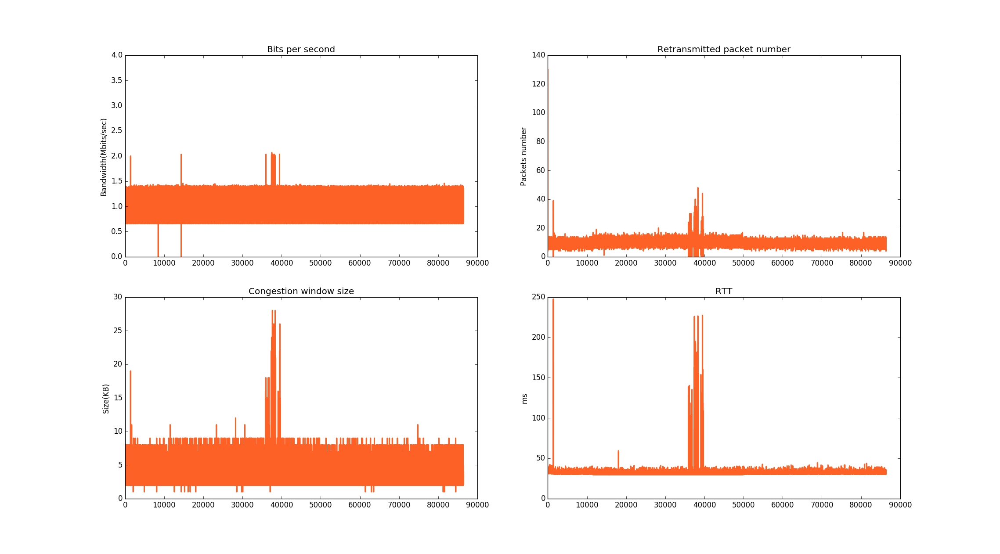

# Lab Record

**开始实验之前需要把收发双方的 iperf3 升级为 [GitHub](https://github.com/esnet/iperf.git) 上的最新版本。**

## 1. dc1 to lan

### 1.1 benchmark

Duration: 24 hours.

Start time: 2017-08-14 21:00

**Status: Finished**

基准测试结果（共 86400s，取 10000s - 70000s）

||Max|Min|Median|Average|Var|
|-|--|---|------|-------|---|
|RTT(ms)|57.00|3.00|8.40|7.00|7.44|
|Bandwidth(Mbit/s)|100.01|70.00|89.55|90.00|4.28|
|Retransmission Packet|15.00|0.00|0.01|0.00|0.02|
|BDP(Mbit)|2800.27|70|376.32|376.32|

结果图像（原始结果：0s - 86400s）：

> 结论：已完成，意外结果较多。故生成上表统计数据的时候采用 10000.0s - 70000.0s 之间网络较为稳定时的数据。

### 1.2 test 0

Duration: 12 hours.

Start time: 2017-08-15 22:00

**Status: Finished**

Duration: 6h

测试结果：

#### round_0：
||Algorithm|Max|Min|Median|Average|Var|
|-|--|---|------|-------|---|--|
|RTT(ms)|bbr|5.44|1.51|3.71|3.72|0.18|
||scalable|21.48|5.21|10.47|11.47|7.12|
||bic|14.55|5.02|9.02|8.08|6.46|
||cubic|14.20|4.21|7.77|7.14|4.18|
||highspeed|19.45|5.22|12.20|12.41|13.92|
|Bandwidth(Mbit/s)|bbr|103.67|74.00|88.33|89.48|13.41|
||scalable|105.63|70.00|89.58|90.00|6.96|
||bic|102.15|89.00|89.53|89.48|1.02|
||cubic|95.45|83.51|89.50|89.48|6.17|
||highspeed|110.00|79.99|89.65|90.00|9.36|
|Retransmission Packet|bbr|2.00|0.00|0.01|0.00|0.02|
||scalable|4.00|0.00|0.01|0.00|0.04|
||bic|2.00|0.00|0.01|0.00|0.01|
||cubic|1.00|0.00|0.01|0.00|0.01|
||highspeed|2.00|0.00|0.01|0.00|0.01|
|BDP(Mbit)|bbr|282.09|55.94|164.07|164.07||
||scalable|1134.34|182.41|468.87|468.||
||bic|743.08|223.52|403.63|403.63|
||cubic|677.53|175.76|347.51|347.51||
||highspeed|1069.95|208.94|546.85|546.85|

bbr:

scalable:

bic:

cubic:

highspeed:

### 1.3 test 1

Duration: 12 hours.

**Status: Executing**

### 1.4 test 2

Duration: 12 hours.

### 1.5 test 3

Duration: 12 hours.

## 2. aliyun1 to amazon

### 2.1 benchmark

Duration: 24 hours.

**Executing**

Start time: 2017-08-15 19:10

### 2.2 test 0

Duration: 12 hours.

### 2.3 test 1

Duration: 12 hours.

### 2.4 test 2

Duration: 12 hours.

### 2.5 test 3

Duration: 12 hours.

## 3. dc2 to aliyun2

### 3.1 benchmark

Duration: 24 hours.

Start time: 2017-08-15 12:02

**Status: Finished**

基准测试结果（共 86400s）

||Max|Min|Median|Average|Var|
|-|--|---|------|-------|---|
|RTT(ms)|247.50|29.27|31.39|30.93|28.63|
|Bandwidth(Mbit/s)|3.50|0.00|1.03|1.33|0.11|   
|Retransmission Packet|130.00|0.00|9.56|9.00|3.13|
|BDP(Mbit)|433.32|0.00|16.10|16.10|

结果图像（原始结果）：

> 结论：已完成，效果显著，而且意外结果较多。

### 3.2 test 0

Duration: 12 hours.

**Status: Executing**

Start time: 2017-08-16 15:06

### 3.3 test 1

Duration: 12 hours.

### 3.4 test 2

Duration: 12 hours.

### 3.5 test 3

Duration: 12 hours.

## 4. dc1 to dc2

### 4.1 benchmark

Duration: 24 hours.

### 4.2 test 0

Duration: 12 hours.

### 4.3 test 1

Duration: 12 hours.

### 4.4 test 2

Duration: 12 hours.

### 4.5 test 3

Duration: 12 hours.

## 5. lan to lan

### 5.1 benchmark

Duration: 24 hours.

### 5.2 test 0

Duration: 12 hours.

### 5.3 test 1

Duration: 12 hours.

### 5.4 test 2

Duration: 12 hours.

### 5.5 test 3

Duration: 12 hours.
